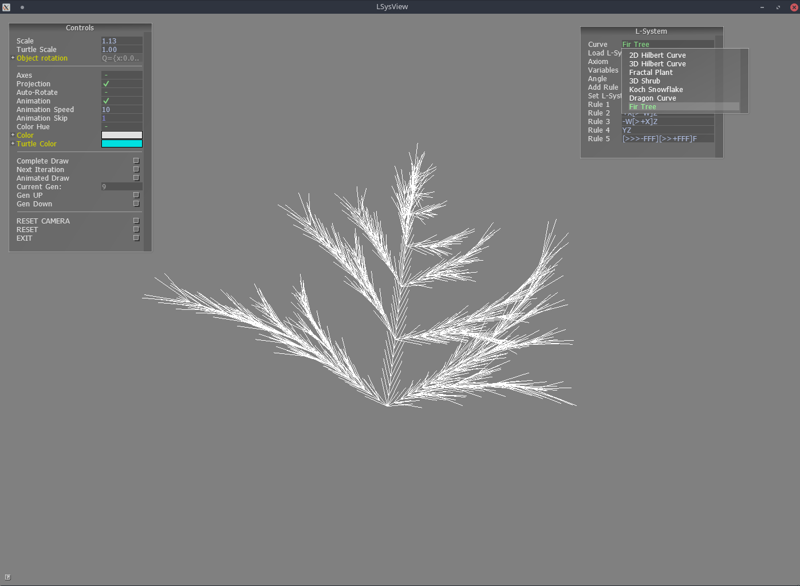

# LSysView 
Made by Kevin Koos

This appliction allows a user to specify a L-system in the application GUI and see the results
drawn on the screen. Systems can also be drawn in an animation which shows how the curve "grows". A set of
specified characters are used by the turtles to operate, all other characters are thrown away and assumed to\
be used as placeholder variables by the L-system. Presets are loaded from a file named "presets.txt" with a 
specified format. Capable of 3D and branching systems. 

GUI was made using the AntTweakBar library avaliable from: http://anttweakbar.sourceforge.net/doc/

Application was built on linux and can be compiled by running the make file.

Final project for CS 450 at OSU



## Alphabet
 * F,D - draw forward one unit
 * f,d - go forward one unit
 * ^,v - pitch up or down
 * <,> - roll counter-clockwise or clockwise
 * -,+ - yaw left or right
 * [,] - push and pop turtle state, creates a branch
 * !   - reverse, pitch up 180 degrees

## Preset Format Example
```
<# of curves>

<name>
<float angle>
<axiom>
<variables>
<rule 1>
<rule 2>
<rule ...>

<name>
...
```

Number of rules specified should be the same as the length of the variables line. Newline between curves 
for readability. 
